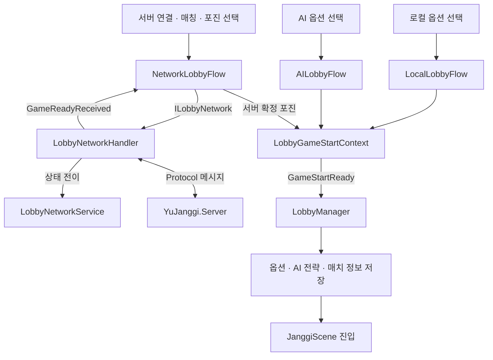
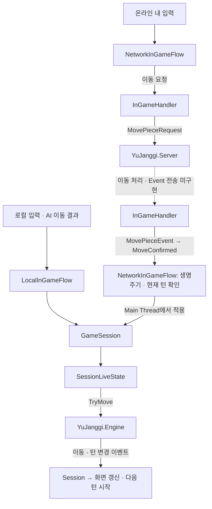

# YuJanggi.Unity

Unity 6 기반 장기 클라이언트입니다. `YuJanggi.Engine`으로 로컬·AI 대국을 진행하며, 서버 매칭과 온라인 대국 준비를 지원합니다.

[로컬·AI·온라인 대국 화면을 빠르게 보여줄 때, 짧은 플레이 GIF]

## 프로젝트 개요

- 로비에서 대국 방식, 진영, 포진 및 제한시간 선택
- `YuJanggi.Protocol`을 사용한 서버 통신
- `YuJanggi.Engine`을 사용한 장기판과 게임 진행

## 기술 스택

- Unity 6000.3.1f1
- C#
- UniTask
- TCP
- TextMeshPro
- YuJanggi.Engine / YuJanggi.Protocol

## 주요 기능

- 로컬 2인 및 AI 대국
- 서버 연결과 Protocol·Engine 버전 Handshake
- 매치메이킹 신청·취소 및 포진 제출
- 서버 `GameReady`의 확정 포진으로 온라인 대국 준비
- 장기판 입력, 이동 가능 위치 표시 및 대국 진행
- 기록을 앞뒤로 탐색하는 리플레이 화면

## 클라이언트 구조

### 로비: 대국 준비와 씬 진입



세 Flow는 `LocalFlow`를 상속하여 이벤트 구독·해제와 `GameStartReady` 알림을 공유합니다. 각 Flow가 대국 준비를 담당하고, `LobbyManager`가 준비 결과를 저장한 뒤 씬을 전환합니다.

온라인 준비 순서는 다음과 같습니다.

```text
MatchingStartRequest → MatchingStartResponse → MatchingFoundEvent
→ FormationSubmit → 양측 포진 완료 → GameReadyEvent
```

매칭 시작·취소는 `RequestDispatcher`로 Response를 기다립니다. `FormationSubmit`은 단방향으로 전송하며, 이후 `GameReadyEvent`로 준비 완료를 확인합니다. Handler는 Protocol 검증·변환과 송수신을, Service는 매칭·포진 상태를 담당합니다.

### 인게임: 시작과 이동 처리

`InGameManager`는 저장된 옵션으로 Engine·Session·View와 모드별 Flow를 구성합니다.

- 로컬·AI: `LocalInGameFlow` 진입 시 `GameSession.StartGame()` 호출
- 온라인: `GameSceneReady` 전송 → 서버의 양측 준비 확인 → `GameStartEvent` 수신 → `GameSession.StartGame()` 호출

아래 도식은 기물 이동 요청과 화면 갱신 경로입니다.



Controller는 Flow에 이동 의도를 전달합니다. 로컬·AI는 Session으로 바로 전달하고, 온라인은 서버 이동 Event를 받은 뒤 Session에 적용합니다. `GameSession`은 Protocol 메시지를 해석하지 않습니다.

현재 클라이언트에는 `MovePieceRequest` 송신과 `MovePieceEvent` 수신·적용 경로가 구현되어 있습니다. 서버의 이동 요청 처리와 Event 전송은 아직 미구현이므로, 온라인 이동 동기화는 완료되지 않았습니다.

## 주요 코드

| 구성 요소 | 역할 |
| --- | --- |
| [`LobbyManager`](Assets/Scripts/Lobby/LobbyManager.cs) | Flow 구성, 대국 준비 결과 저장과 씬 진입 |
| [`LocalFlow`](Assets/Scripts/Lobby/Flow/LocalFlow.cs) | 로비 Flow의 공통 이벤트 생명주기와 준비 완료 알림 |
| [`NetworkLobbyFlow`](Assets/Scripts/Lobby/Flow/NetworkLobbyFlow.cs) | 연결·매칭·포진 제출과 온라인 대국 옵션 준비 |
| [`LobbyNetworkHandler`](Assets/Scripts/Lobby/LobbyNetwork/LobbyNetworkHandler.cs) | 매칭 Protocol 송수신·변환과 Service 상태 반영 |
| [`InGameManager`](Assets/Scripts/InGame/InGameManager.cs) | Engine·Session·View 구성과 Flow 생명주기 관리 |
| [`NetworkInGameFlow`](Assets/Scripts/InGame/Flow/NetworkInGameFlow.cs) | 온라인 시작 대기, 이동 요청과 서버 이동 Event 적용 |
| [`InGameHandler`](Assets/Scripts/InGame/Handler/InGameHandler.cs) | 인게임 Protocol 송수신·검증과 이동 알림 |
| [`GameSession`](Assets/Scripts/InGame/Session/GameSession.cs) | 대국·리플레이 상태 관리와 Engine 이벤트 연결 |

## 실행 방법

1. Unity 6000.3.1f1로 프로젝트를 엽니다.
2. `Packages/manifest.json`의 Engine·Protocol 로컬 패키지 경로가 현재 컴퓨터의 저장소 위치를 가리키는지 확인합니다.
3. [`BootStrapScene`](Assets/Scenes/BootStrapScene.unity)을 실행합니다. 초기화 후 `LobbyScene`으로 이동합니다.
4. 로컬 또는 AI 대국을 선택합니다. 온라인 대국은 `YuJanggi.Server.V2`를 실행한 뒤 로비에서 서버에 연결합니다.

기본 서버 주소는 `YuJanggiBootStrap`에 설정된 `127.0.0.1:7777`입니다.

## 관련 프로젝트

- `YuJanggi.Server.V2`: 온라인 대국 서버
- `YuJanggi.Engine`: 장기 규칙과 게임 진행
- `YuJanggi.Protocol`: 통신 메시지와 DTO

## 포트폴리오

[게임 플레이와 상세 설계 과정을 소개할 때, 포트폴리오 링크]
