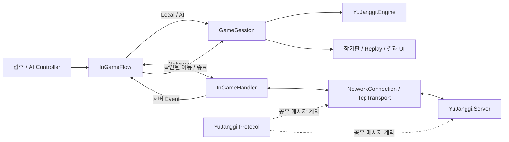

# YuJanggi.Unity

Unity 기반 장기 클라이언트입니다. Local / AI / Network 대국을 제공하며, 장기 규칙은 `YuJanggi.Engine`, 서버 통신 계약은 `YuJanggi.Protocol` 패키지로 분리합니다.

게임 모드에 따라 Flow를 교체하고, GameSession과 View를 통해 대국 진행·리플레이·결과 표시를 연결합니다. Network에서는 요청의 Response와 서버 Event를 구분해 이동과 종료 결과를 반영합니다.

## 다운로드

[Windows 설치파일 다운로드 — YuJanggi v1.0.0](Downloads/YuJanggi_V1.0.0_Setup.exe?raw=true) · 약 35MB

다운로드한 설치파일을 실행해 설치합니다. 제공된 `v1.0.0` 설치파일은 별도 빌드 결과물이며, 아래 설명은 현재 저장소의 소스를 기준으로 합니다. 설치파일의 기능과 현재 소스의 일치 여부는 별도 실행 확인이 필요합니다.

## 기술 스택

| 기술 | 사용 영역 |
| --- | --- |
| Unity 6000.3.1f1 / C# | 게임 클라이언트 |
| UniTask | 연결·요청 응답·Flow의 비동기 처리 |
| TCP / System.Text.Json | 서버 통신과 Protocol 직렬화 |
| Input System | 사용자 입력 |
| uGUI / TextMeshPro | 로비·대국·결과 UI |
| Universal Render Pipeline / DOTween | 화면 표현과 애니메이션 |
| Unity Package Manager | Engine / Protocol 공용 패키지 참조 |

## 주요 기능

- Local 2인 대국과 AI 대국
- 기물 선택과 이동 가능 위치 표시
- 대국 기록 기반 리플레이
- TCP 연결과 Engine / Protocol 버전 Handshake
- 온라인 매칭 신청·취소와 포진 제출
- 서버 Event를 통한 대국 시작·이동·종료 반영
- Main Lobby 복귀 시 이전 매치 상태 초기화와 연결 해제

AI 전략은 Random, Greedy, Minimax를 제공합니다. Minimax 탐색은 반복 심화와 Alpha-Beta 가지치기, 이동 정렬, Transposition Table을 사용합니다.

## 구조



Controller는 입력을 이동 의도로 전달하고, Flow는 모드별 처리 경로를 선택합니다. GameSession은 Engine과 Controller·View를 연결하며, 상태별로 대국·리플레이·종료 동작을 관리합니다.

| 모드 | Lobby Flow | InGame Flow | 진행 방식 |
| --- | --- | --- | --- |
| Local | LocalLobbyFlow | LocalInGameFlow | 한 클라이언트에서 두 진영 입력 |
| AI | AILobbyFlow | LocalInGameFlow | 사용자 입력과 AI Controller의 이동 |
| Network | NetworkLobbyFlow | NetworkInGameFlow | 서버 요청과 Event 수신 후 상태 반영 |

Local과 AI는 서버 없이 진행합니다. Network에서도 로컬 입력 Controller를 재사용하며, 서버 전송 여부는 Flow에서 결정합니다.

### 주요 코드

| 구성 요소 | 책임 |
| --- | --- |
| [LobbyManager](Assets/Scripts/Lobby/LobbyManager.cs) | 모드별 준비 Flow 구성, 게임 시작 옵션 저장, 씬 진입 |
| [InGameManager](Assets/Scripts/InGame/InGameManager.cs) | Engine·Session·View·Flow 조립과 생명주기 |
| [NetworkInGameFlow](Assets/Scripts/InGame/Flow/NetworkInGameFlow.cs) | 온라인 준비·이동·종료 처리와 서버 Event 적용 |
| [GameSession](Assets/Scripts/InGame/Session/GameSession.cs) | 대국·리플레이·종료 상태 및 Engine 이벤트 연결 |
| [InGameHandler](Assets/Scripts/InGame/Handler/InGameHandler.cs) | 인게임 Protocol 메시지 송수신과 Event 전달 |
| [NetworkManager](Assets/Scripts/Bootstrap/NetworkManager.cs) | 수신 메시지 분배와 연결·매치 상태 관리 |
| [RequestDispatcher](Assets/Scripts/Network/RequestDispatcher.cs) | RequestId 기반 응답 연결과 요청 대기 정리 |
| [TcpTransport](Assets/Scripts/Network/TcpTransport.cs) | TCP 송수신, 직렬화·프레이밍 호출과 송신 직렬화 |

## Network 흐름

### 매칭과 대국 시작

```text
연결·Handshake
→ MatchingStartRequest / MatchingStartResponse
→ MatchingFoundEvent
→ FormationSubmit (양측 포진 제출)
→ GameReadyEvent
→ JanggiScene
→ GameSceneReady (양측 씬 준비)
→ GameStartEvent
→ GameSession.StartGame()
```

`FormationSubmit`과 `GameSceneReady`는 단방향 메시지입니다. 포진 준비 완료와 대국 시작은 각각 `GameReadyEvent`, `GameStartEvent`로 확인합니다.

### 이동과 게임 종료

```text
사용자 이동
→ MovePieceRequest
→ MovePieceResponse (요청 처리 결과)
→ MovePieceEvent
→ GameSession → Engine에 이동 반영

Local Engine GameEnd
→ GameEndRequest
→ GameEndResponse (요청 처리 결과)
→ GameEndedEvent
→ 최종 GameResult 반영
→ 종료 Info 표시
```

`MovePieceResponse`의 Accepted만으로 Engine을 변경하지 않습니다. 내 이동과 상대 이동 모두 `MovePieceEvent`를 통해 적용합니다. Replay 상태에서도 수신 이동을 Engine에 전달해 실제 대국 진행과 리플레이 화면을 구분합니다.

Network에서는 로컬 Engine의 종료 결과를 보관하고 서버 확인을 기다립니다. `GameEndResponse`만으로 종료 Info를 표시하지 않으며, `GameEndedEvent`의 Winner와 TotalMoves를 반영한 뒤 종료 상태로 전환합니다. Local / AI는 기존 로컬 종료 결과를 사용합니다.

Main Lobby를 선택하면 `LobbyScene` 로드 전에 이전 매치 상태를 초기화하고 연결을 해제합니다. 씬이 비활성화될 때 Flow를 종료하고 이벤트 구독을 해제합니다.

### 요청 응답과 Event 분리

`NetworkManager`는 RequestId가 있는 메시지를 `RequestDispatcher`로 전달해 해당 요청의 대기를 완료합니다. RequestId가 없는 Event는 `LobbyNetworkHandler` 또는 `InGameHandler`로 전달합니다. 연결 종료 시 대기 중인 요청도 정리합니다.

Handshake는 일반 수신 루프 시작 전에 `NetworkConnection`에서 직접 처리합니다.

## 공용 패키지

동일한 Engine / Protocol 소스를 서버는 NuGet으로, Unity는 UPM으로 사용합니다.

| 패키지 | 역할 | 현재 manifest 참조 |
| --- | --- | --- |
| YuJanggi.Engine | 장기 규칙, Board / Turn / Record / Score | `com.seokjinyoo.yujanggi.engine-2.5.1.tgz` |
| YuJanggi.Protocol | 메시지 계약, JSON 직렬화, 길이 기반 Packet Framing | `com.seokjinyoo.yujanggi.protocol-1.5.2.tgz` |

[manifest.json](Packages/manifest.json)은 두 패키지의 로컬 `.tgz` 파일을 참조합니다. 다른 PC에서는 파일을 확보한 뒤 실제 위치에 맞춰 참조 경로를 변경해야 합니다.

Engine / Protocol 저장소의 GitHub Actions는 Tag 기준으로 버전을 설정하고 Build / Test 후 NuGet과 UPM을 패키징합니다. NuGet은 CD에서 GitHub Packages에 Publish하며, UPM `.tgz`는 Actions Artifact로 제공합니다. Unity에서는 해당 Artifact를 다운로드해 로컬 패키지로 설치합니다. 이 Unity 저장소에는 현재 별도 CI/CD Workflow가 없습니다.

## 소스 실행 방법

1. Unity Hub에서 **Unity 6000.3.1f1**을 설치하고 프로젝트를 엽니다.
2. Engine / Protocol `.tgz`를 준비하고 [manifest.json](Packages/manifest.json)의 로컬 경로를 맞춥니다.
3. [BootStrapScene](Assets/Scenes/BootStrapScene.unity)을 열고 Play합니다. 초기화 후 `LobbyScene`으로 이동합니다.
4. Local / AI 모드를 선택하면 서버 없이 대국을 시작합니다.
5. Network 모드는 `YuJanggi.Server`를 실행하고 두 클라이언트에서 같은 서버에 연결합니다. 서버와 클라이언트의 Engine / Protocol 버전은 Handshake 검사를 통과해야 합니다.

### 서버 주소 설정

[YuJanggiBootStrap](Assets/Scripts/Bootstrap/YuJanggiBootStrap.cs)은 환경변수를 읽어 서버 접속 주소를 결정합니다.

| 환경변수 | 적용 방식 | 기본값 |
| --- | --- | --- |
| `SERVER_HOST` | 공백이 아닌 값을 Trim해서 사용 | `127.0.0.1` |
| `SERVER_PORT` | 정수로 파싱할 수 있으면 사용 | `7777` |

Windows 사용자 환경변수를 변경한 뒤에는 **Unity Hub와 Editor를 모두 종료하고 다시 실행**해야 새 프로세스에 반영됩니다. 최종 적용 주소는 `Server endpoint: <host>:<port>` 로그로 확인할 수 있습니다.

## 주요 디렉터리

```text
Assets/
├─ Scenes/               # Bootstrap·Lobby·대국 씬
└─ Scripts/
   ├─ Bootstrap/         # 초기화와 NetworkManager·AudioManager
   ├─ Lobby/             # 모드별 준비 Flow와 매칭·포진 통신
   ├─ InGame/
   │  ├─ Controller/     # Local·AI·Remote 입력 역할
   │  ├─ Flow/           # 모드별 시작·이동·종료 경로
   │  ├─ Handler/        # 인게임 메시지 처리
   │  ├─ Service/        # 게임 시작 상태·대기
   │  ├─ Session/        # 대국·Replay·종료 상태 관리
   │  └─ Views/          # 게임 화면 표현
   ├─ Network/           # Transport·Connection·요청 추적
   └─ Runtime/           # Input·Board·Piece·Particle·UI
Packages/                # UPM 의존성 설정
ProjectSettings/         # Unity 버전과 프로젝트 설정
Downloads/               # Windows 설치파일
```

## 현재 제한

- 서버의 Engine 기반 이동 검증은 아직 구현되지 않았습니다. 현재 `GameService.ValidateMove`는 Accepted를 반환하므로 서버가 합법 이동을 최종 판정하는 구조는 아닙니다.
- 재접속 시 대국 Snapshot을 복구하는 경로는 없습니다.
- 온라인 무르기·한 수 쉼은 별도 서버 요청·Event 계약으로 동기화되지 않습니다.
- 온라인 제한시간은 클라이언트 기본 옵션을 사용하며 서버 TurnTime 계약은 없습니다.

## 관련 프로젝트

- [YuJanggi.Engine](https://github.com/SeokJinYoo98/YuJanggi.Engine) — Unity 비의존 장기 규칙과 게임 상태
- [YuJanggi.Protocol](https://github.com/SeokJinYoo98/YuJanggi.Protocol) — 클라이언트·서버 공유 메시지 계약과 패키징
- [YuJanggi.Server](https://github.com/SeokJinYoo98/YuJanggi.Server) — 연결·매칭·게임 룸과 서버 메시지 처리
